# 📱 GSTfied - All About GST Calculator

If you're tired of local GST calculators that always disappoint you with GST calculations or other important calculations, don't worry! Try **GSTfied - All About GST Calculator**. This app is a free, user-friendly calculator that is easy to use for basic arithmetic functions. It helps you calculate GST rates on your mobile with just a click of a button. Whether you need to add, subtract, multiply, or divide, the GSTfied All About GST Calculator covers you. 💡📊

## 🚀 Features

- **Free to Download**: Enjoy all features without any cost. 🆓
- **User-Friendly Interface**: Easy to understand and attractive user interface. 🌟
- **Customizable GST Values**: Change GST values as per your requirements. 🔧
- **Device Compatibility**: Compatible with all devices. 📱💻
- **Instant GST Calculation**: Single tap to calculate GST for different Indian tax slabs (3%, 5%, 12%, 18%, 28%) or any customized % of GST. 🧮
- **Comprehensive GST Functionality**: Includes GST buttons, GST and SGST calculations, GST billing, GST returns filing, e-way billing, and more. 📜
- **Financial Tools**: Includes Income Tax Calculator, GST Calculator, and Interest Rate Calculator. 💰📉
- **Local Backup with Encrypted Database**: Securely back up your data locally with encryption. 🔒💾
- **PDF Report Generation**: Generate and share detailed PDF reports. 📄
- **Educational Content**: Study the history of GST, GST FAQs, Indian state codes, information about GST implementation, and GST member conciliation. 📚
- **Business Tools**: Create a company, add customers, add products, create watermark invoicing, generate reports, get invoice backups, and check invoice history. 🏢📈

## 📥 Download Now 

Experience the best GST calculator with the GSTfied All About GST Calculator app.

## 🛠️ Built With

- **Native Android**: Built using Java and Kotlin for a seamless and efficient user experience. 🤖

## 📚 How to Use

1. **Basic Arithmetic Functions**: Use the calculator for basic arithmetic functions. ➕➖✖️➗
2. **GST Calculation**: Enter the transaction's initial amount and GST rate; the results will be calculated as you type. 💹
3. **Check GSTIN**: Verify GST Identification Numbers easily. 🔍
4. **HSN Code Generator**: Generate HSN codes with a single tap. 📋
5. **Manage Finances**: Use the suite of tools for income tax, GST, and interest rate calculations. 🏦
6. **Create Invoices**: Add customers and products, create watermark invoicing, and manage your business efficiently. 🧾
7. **Local Backup**: Securely back up your data locally with an encrypted database. 🗄️
8. **Generate PDF Reports**: Create and share detailed PDF reports for your records. 📑

## 🎉 Top Features

- **Download for Free** 🆓
- **Easy to Understand** 👍
- **Attractive User Interface** 👌
- **Change GST Value as Required** 🔄
- **Compatible with All Devices** 📱💻
- **Single Tap to Calculate GST** 👆

## 📘 Learn More

Explore more with the GSTfied All About GST Calculator app. Study the history of GST, learn where GST terms come into the market, access GST FAQs, and get detailed information about Indian state codes and GST implementation. 🧠

## 💼 Business Features

- **Create a Company**: Use the simple GST Calculator to create a company. 🏢
- **Add Customers and Products**: Manage your business by adding customers and products. 👥📦
- **Generate Reports and Backups**: Create watermark invoicing, generate reports, get invoice backups, and check invoice history. 📊📂

## 📸 Screenshots

Take a look at some of the screenshots from the app: 🖼️

  
  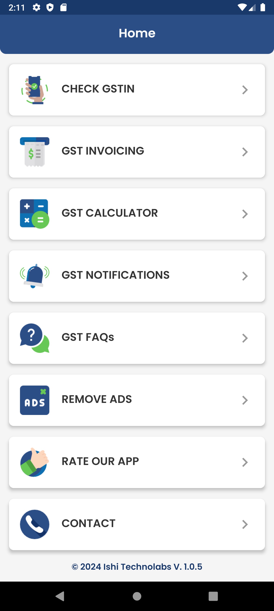
  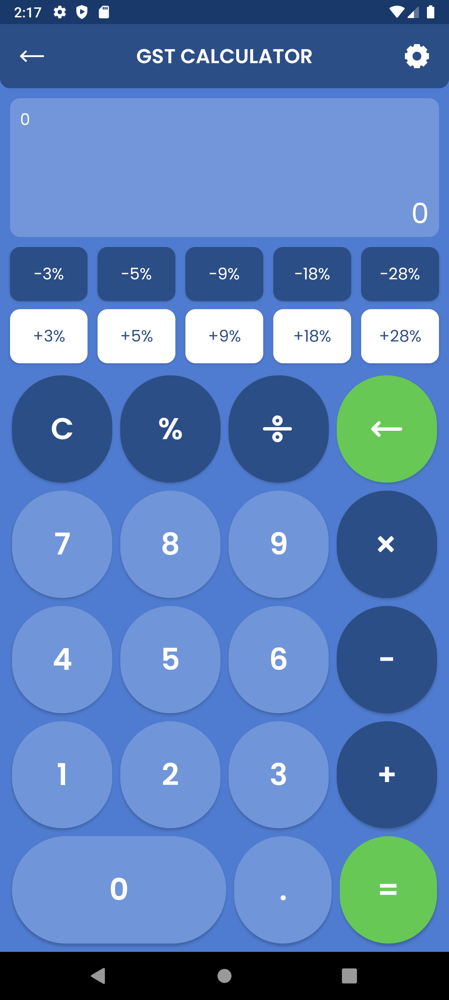
  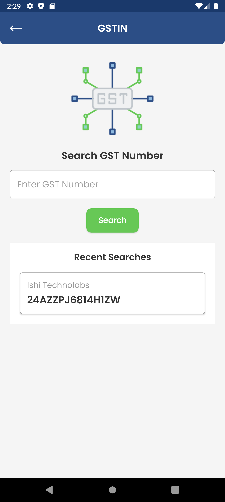
  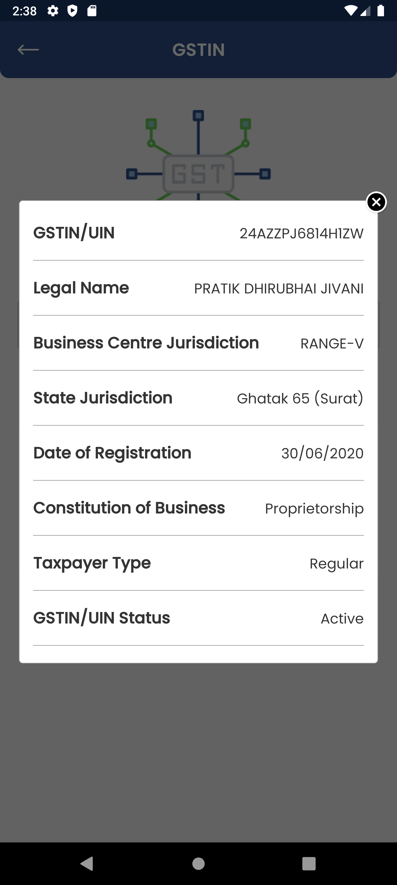
  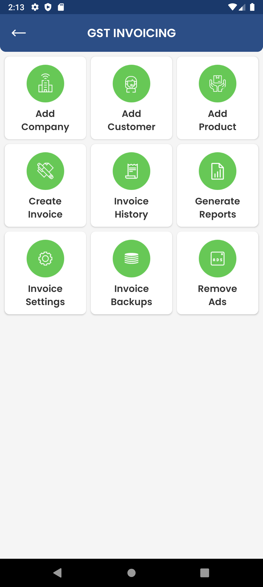
  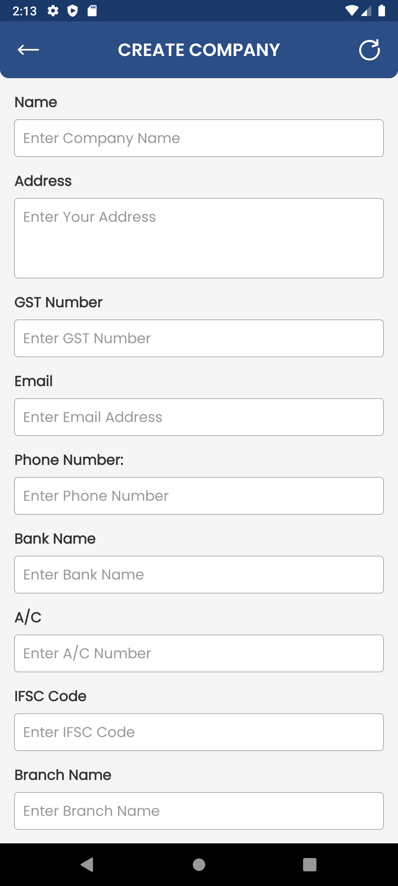
  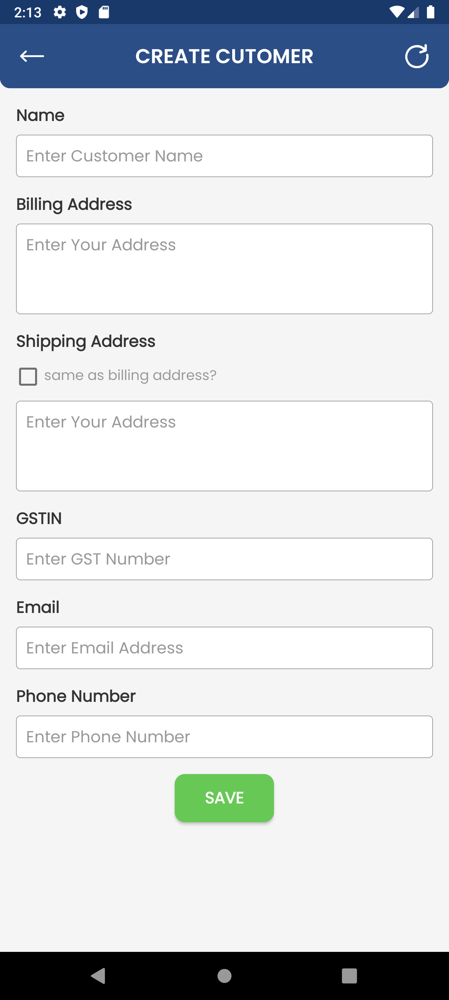
  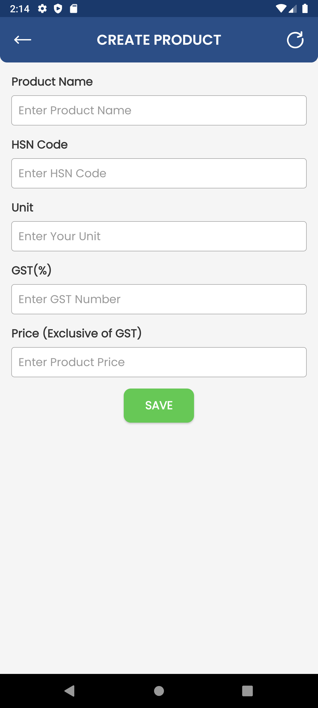
  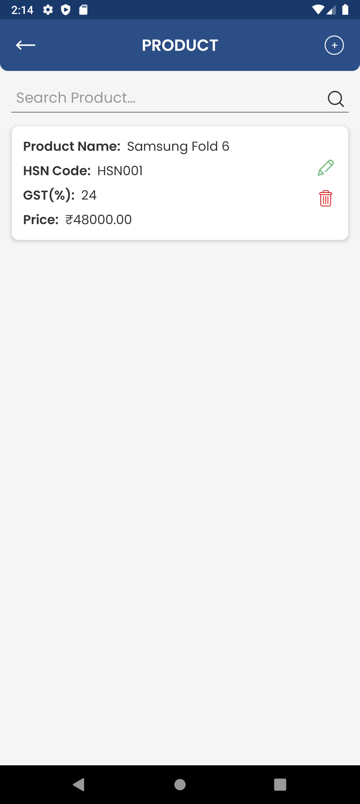
  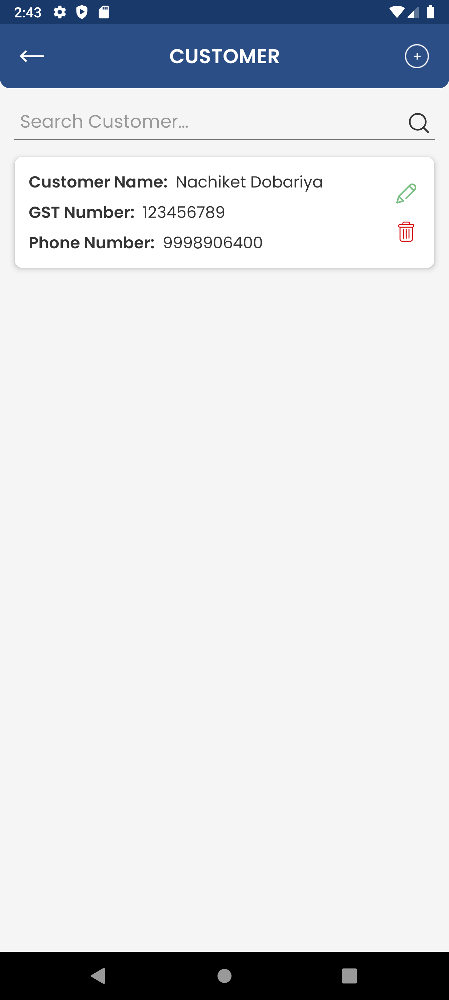
  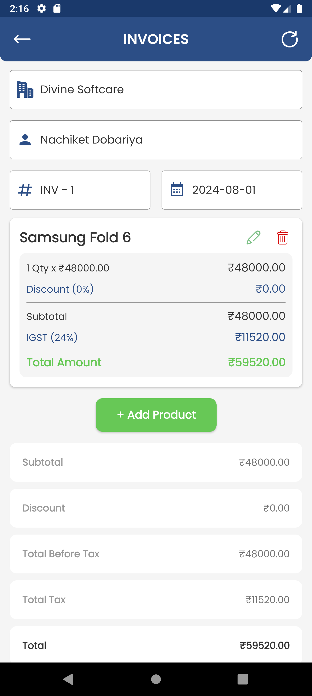
  
  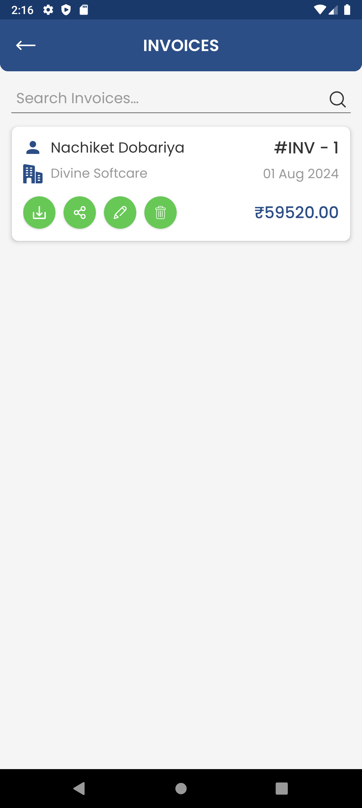
  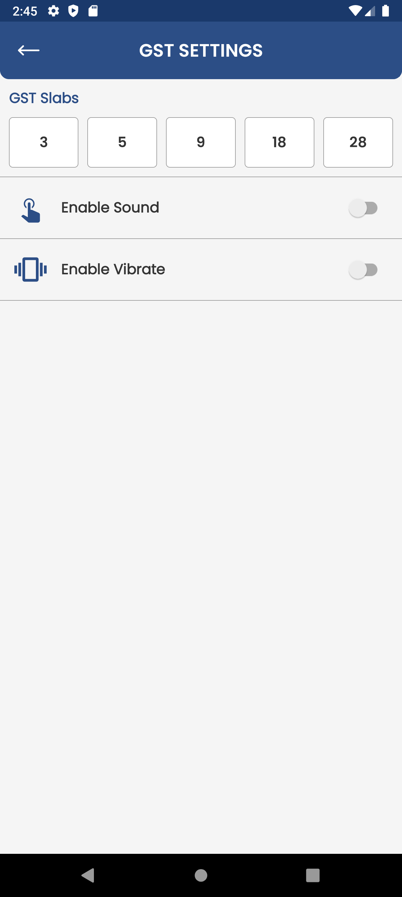
  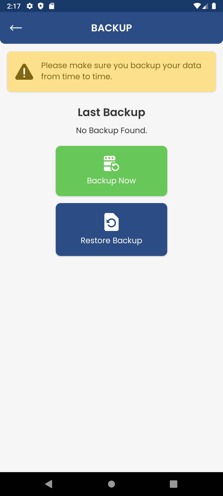
  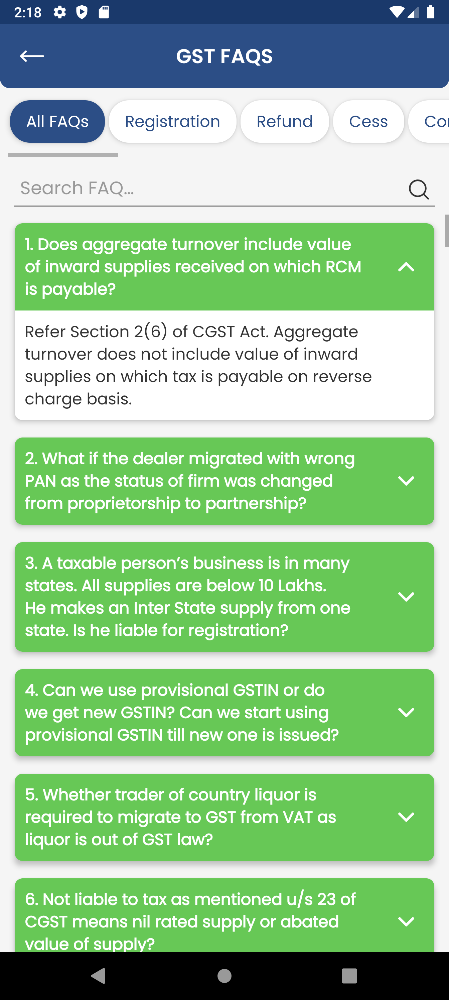
  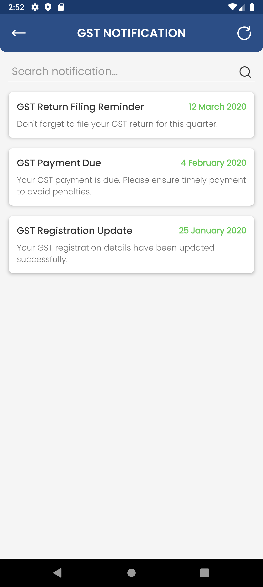

---
